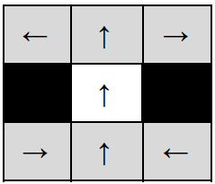

# Path Planning Algorithms

A simple version of Hybrid A* is implemented by simplifying the Ackermann model.

### Motion Model



### Example path from A to B


# Directory Structure
```
.
├── build.sh
├── CMakeLists.txt
├── Config.yaml
├── external
│   └── yaml-cpp
├── include
│   ├── PathPlanner.h
│   └── YAMLParser.h
├── README.md
└── src
    ├── Main.cpp
    ├── PathPlanner.cpp
    └── YAMLParser.cpp
```

#### How to run

> Please make sure that you have `CMake` installed in the system.

- Extract the directory and go to path-planning directory
```
unzip path-planning.zip && cd path-planning
```

- Now, build the code using the bash script given in the folder

```
./build.sh
```

This will build and external dependency also, as a result it takes a little while, about a minute to build. When built successfully, it generates an executable file 'pathplanner' in the current directory. Execute this file by supplying 'Config.yaml' as a command line argument. 'build.sh' includes this execution as a sample. This can be done again using the command given below,

```
./pathplanner Config.yaml
```